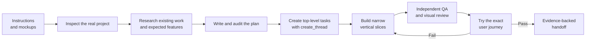

<div align="center">

# ProjectStart

### A Codex skill for keeping long-running projects focused, visible, and honest.

[](./SKILL.md)
[](./scripts)
[](./assets/project-kit/FOCUS_PROTOCOL.md)
[](./LICENSE)

<a href="https://github.com/LiquidGlek/ProjectStart/archive/refs/heads/main.zip"></a>

</div>

---

I built this after asking agents to fix one button and coming back twelve hours later to find that the button still did not work. They had written tests, investigated unrelated code, and made plenty of progress on everything except the thing I asked for.

A checklist helped immediately. This skill is the larger version of that idea.

ProjectStart gives a Codex project a Director, one master checklist, separate task checklists, deadlines, ownership boundaries, correction records, prior-art research, visual gates, and evidence rules. The point is not to create more paperwork. The point is to let the agents work without constant babysitting while making it difficult for them to quietly drift away from the actual product.

> [!IMPORTANT]
> Every lasting role or product domain must be a separate, sidebar-visible Codex task created with `create_thread`. `spawn_agent` is not a substitute for a developer, QA task, visual auditor, integrator, release owner, researcher, or any other durable project lane. If task creation fails, that lane stays blocked.

## What it is trying to fix

| What kept happening | What ProjectStart does about it |
|---|---|
| The requested feature stayed broken while side work multiplied | Locks the primary outcome and allows one current vertical slice |
| Agents wrote dozens of tiny tests that changed nothing | Makes every test name the open gate and the decision its result can change |
| The finished UI barely resembled the mockup | Requires measurements and a real-control skeleton before feature work |
| Obvious features were missed because I did not list every industry standard | Researches competitors, open-source projects, and table-stakes workflows first |
| A correction was forgotten ten hours later | Records corrections as durable IDs and checks for recurrence |
| Agents could not find or communicate with one another | Registers every task by exact ID and deeplink |
| A hidden subagent ended up owning half the product | Requires every durable lane to be a real top-level task |
| A build or unit test was reported as proof the app worked | Requires evidence at the same level as the claim |

## How a project runs



Planning happens before the large checklists are created. The initial checklist stays small: inspect, understand intent, research, plan, and then derive the real work. This prevents the project from locking itself into a bad first guess.

## What the skill creates

```text
Your Project/
├── PROJECT_CHARTER.md          # What the user actually wants and does not want
├── PRIOR_ART_RESEARCH.md       # Existing products, open source, and reuse decisions
├── PROJECT_PLAN.md             # Architecture and ordered vertical slices
├── MASTER_CHECKLIST.md         # The only authority for project completion
├── COORDINATION_BOARD.md       # Ownership, deadlines, blockers, and live state
├── AGENT_COMMUNICATION.md      # Task IDs, deeplinks, and message routing
├── DECISION_LOG.md             # Decisions and user corrections that must survive context loss
├── EVIDENCE_LEDGER.md          # Proof for every completed claim
├── FOCUS_PROTOCOL.md           # Drift alarms and patch-spiral circuit breakers
├── VISUAL_PROTOCOL.md          # Mockup fidelity and skeleton approval
├── TEAM_OPERATING_MODEL.md     # Director, developer, QA, and audit roles
└── agent-checklists/
    ├── coordinator.md
    └── one checklist for every top-level task
```

## Install

### Easiest: ask Codex to install it

Copy this into a Codex task:

```text
Use $skill-installer to install the project-start skill from https://github.com/LiquidGlek/ProjectStart and name it project-start.
```

The installer downloads public GitHub skills directly and refuses to overwrite an existing skill directory.

### Manual install

Clone the repository into your Codex skills directory as `project-start`:

### Windows PowerShell

```powershell
git clone https://github.com/LiquidGlek/ProjectStart.git "$env:USERPROFILE\.codex\skills\project-start"
```

### macOS or Linux

```bash
git clone https://github.com/LiquidGlek/ProjectStart.git ~/.codex/skills/project-start
```

If that folder already exists, preserve or remove it intentionally before cloning. Do not blindly overwrite an existing skill.

## Use it

Open a Codex task inside the project you want to build. Give it your instructions, constraints, deadline, and any mockups or reference images. Then invoke:

```text
$project-start
```

The Director will inspect the project and references, write down the user intent, research what already exists, create an audited project plan, and split the work into a small number of independently owned lanes. Each durable lane becomes its own top-level Codex task with an exact checklist, task ID, deeplink, deadline, and handoff.

The Director coordinates and checks evidence. It does not quietly become the main developer when another task is blocked.

## When work needs a new task

It needs a **new top-level Codex task** if it owns any of the following:

- A master-checklist requirement or acceptance gate.
- Production files, a product system, a shared seam, or runtime state.
- Its own deadline, checklist, model allocation, or durable handoff.
- Implementation, integration, packaging, installation, release work, QA, or visual approval.
- Work that another task must be able to find, message, pause, or resume later.

A subagent is only for one bounded piece of temporary help inside an existing task. It owns no project lane, production change, runtime, checklist, deadline, or approval.

If there is any doubt, create a top-level task.

## Validation

The initializer copies the control kit into a project without overwriting files that are already there:

```powershell
.\scripts\Initialize-ProjectStart.ps1 `
  -TargetPath C:\Projects\MyApp `
  -Outcome "The requested user journey works in the real application." `
  -AcceptanceJourney "Fresh launch -> user action -> authoritative result -> restart persistence"
```

The validator has two modes:

```powershell
# Reports planning placeholders but permits the initial planning stage
.\scripts\Test-ProjectControls.ps1 -TargetPath C:\Projects\MyApp

# Must pass before substantive implementation begins
.\scripts\Test-ProjectControls.ps1 -TargetPath C:\Projects\MyApp -Strict
```

Strict mode rejects unresolved plans, malformed task registries, missing `create_thread` receipts, and durable lanes assigned to `spawn_agent`.

## A few rules I care about

- The user's latest explicit direction wins. Write it down instead of trusting chat history.
- Research before rebuilding something that already exists.
- Build the real mockup skeleton before filling it with features.
- Do not ask the user for approval on ordinary, reversible work inside an assigned lane.
- A passing test does not prove an installed application, device, account, or public service works.
- Two failed candidates for the same journey trigger a stop and a deeper transaction review.
- Percentages never outweigh one critical broken feature.

## Repository map

| Path | What it contains |
|---|---|
| [`SKILL.md`](./SKILL.md) | The controlling Codex workflow |
| [`agents/openai.yaml`](./agents/openai.yaml) | Skill metadata |
| [`assets/project-kit/`](./assets/project-kit) | The project documents and templates |
| [`scripts/Initialize-ProjectStart.ps1`](./scripts/Initialize-ProjectStart.ps1) | The safe initializer |
| [`scripts/Test-ProjectControls.ps1`](./scripts/Test-ProjectControls.ps1) | Activation and strict validation |
| [`LICENSE`](./LICENSE) | MIT open-source license |

## Current validation

The current package has passed skill-package validation, PowerShell parsing, fresh initialization, activation auditing, a deliberate test proving a `spawn_agent` project lane is rejected, and another initialization from a clean ZIP extraction.

ProjectStart is open source under the [MIT License](./LICENSE).

---

<div align="center">

**The goal is simple: come back to the product you asked for.**

</div>
